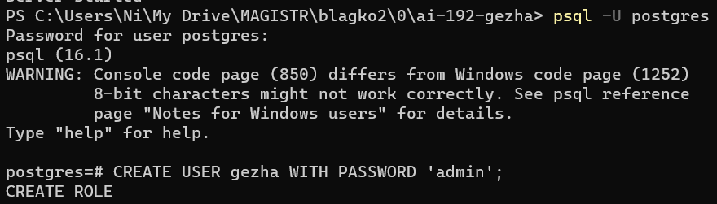
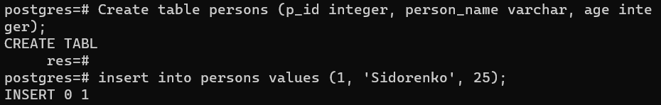
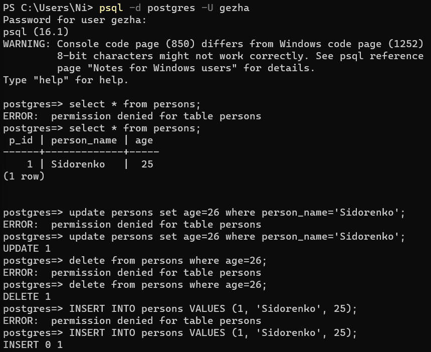
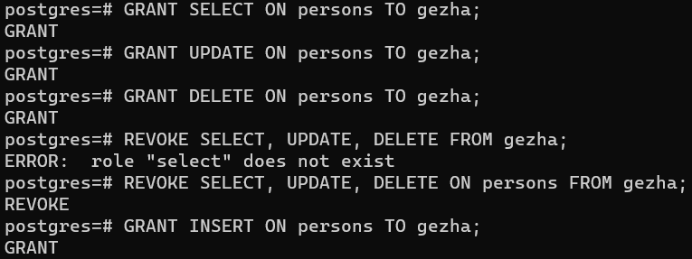

Підєднання до сервера та створення нового користувача. Роль була створена автоматично

Створення нової таблиці та додавання до неї запису

Підєднання до бази даних від імені нового користувача з нового терміналу, та спроби проводити операції над таблицею. Після невдачної спроби, на першому вікні терміналу даному користувачу надавалося відповідний доступ, після чого повторна спроба була вдачною

Процедура надання та видалення дозволів для нового користувача з першого вікна терміналу

