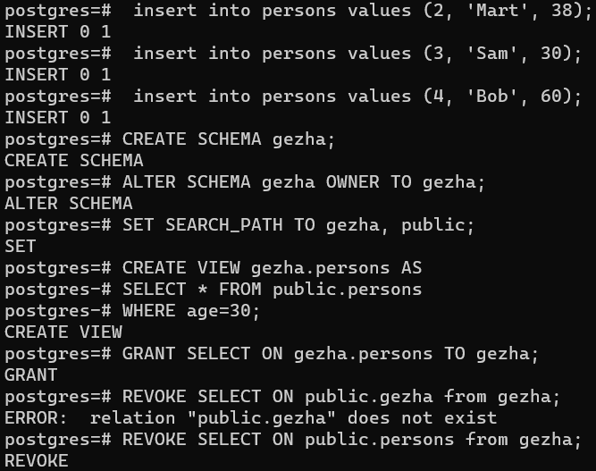
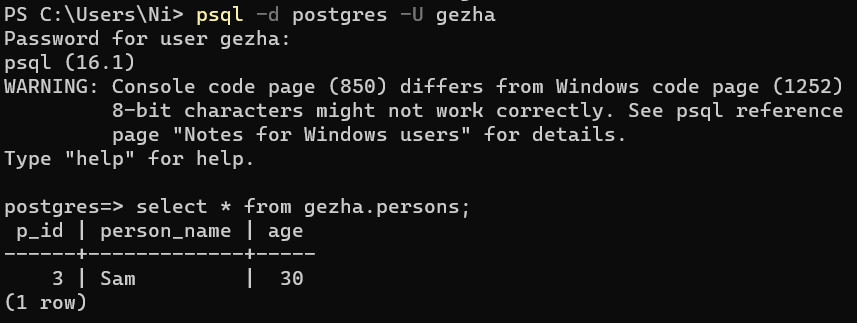
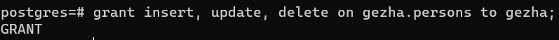
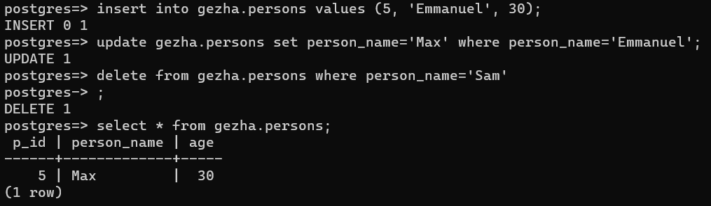

Додавання ще 3 значень до таблиці, створення нової схеми бази даних з дозволом на перегляд лише тих значень таблиці де людям є 30 років, та надання відповідного дозволу до схеми користувачу

Підєднання до БД від імені нового користувача та перегляд таблиці через схему

Надання додаткових правил до схеми

Проведення інших операцій від імені нового користувача через схему
