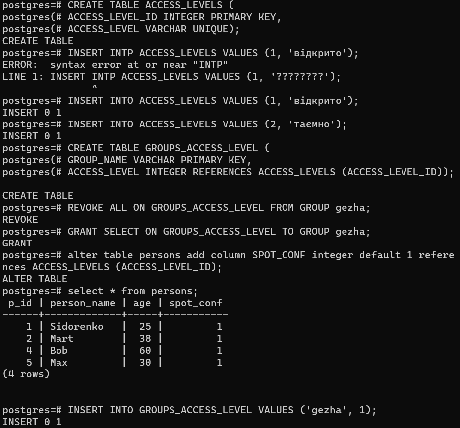
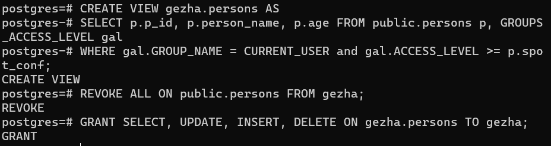
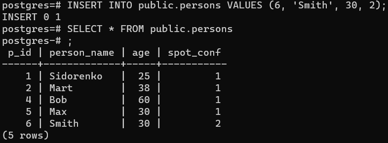
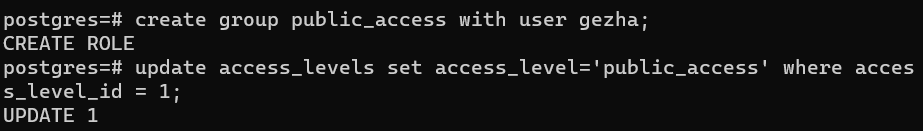
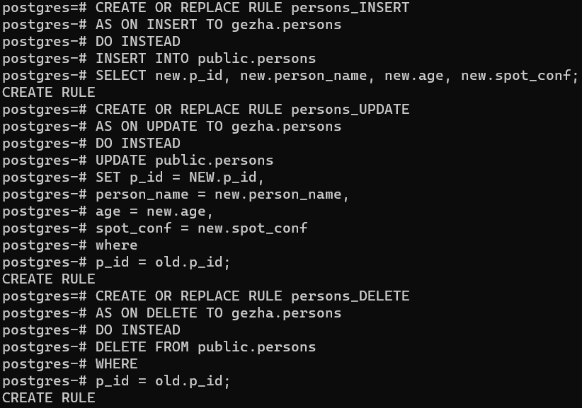
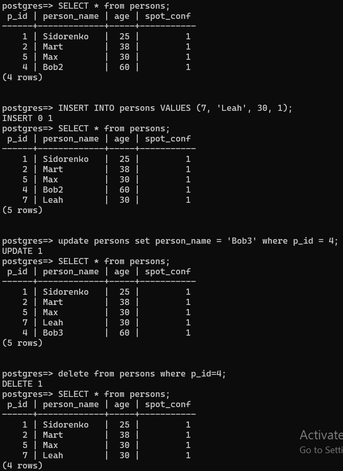

Було створено необхідні структури для керування доступом, додані рівні доступу, колонку з рівнем доступу, та додано рівень доступу для користувача

Створено віртуальну таблицю, що показиватиме лише ті записи, до яких у групи користувача є доступ

У таблицю persons було додано запис, у якого вищій рівень доступу ніж у користувача (2 vs 1)

Користувача було додано до нової групи. Назву рівеня доступу було змінено, бо вона повинна відповідати назві групи, яка не підтримує не-латинські літери.

Було створено правила до операцій що модифікують віртуальну таблицю.

Було перевірено операції над віртуальною таблицею від імені нового користувача. Як очікувано, таблиця не відображає записи з рівнем доступу, вищим за той що є у користувача.

