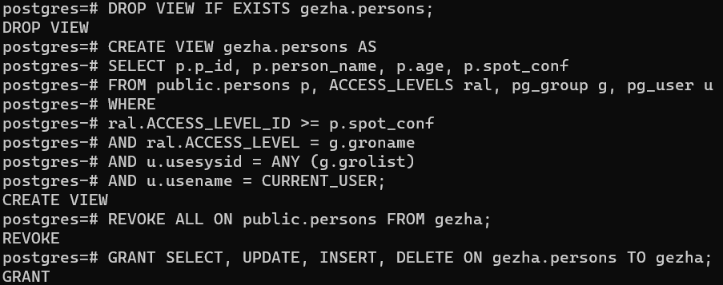

Було створено необхідні структури для керування доступом, додані рівні доступу, створено віртуальну таблицю яка фільтрує результати за значеннями рівня доступу, та додано рівень доступу для користувача

Віртуальна таблиця була відредагована таким чином, щоб отримувати значення лише з таблиці persons

У таблицю persons було додано запис, у якого вищій рівень доступу ніж у користувача (2 vs 1)

Було перевірено операцію на перегляд таблиці від імені нового користувача. Перегляд коректно показує усі записи, приховуючі запис з рівнем доступу який вище ніж у користувача. Але, UPDATE/INSERT/DELETE операції неможливі, бо нема правила щодо виконання цих операцій

Було виконано спробу створити правило для оновлення таблиці, але у ньому є помилка, яку не довелося вирішити

