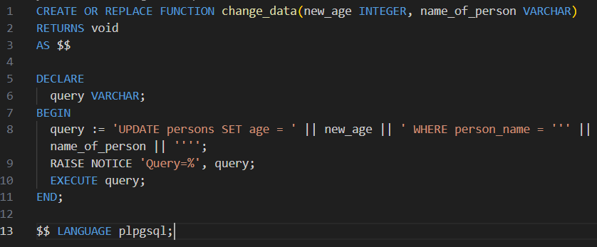
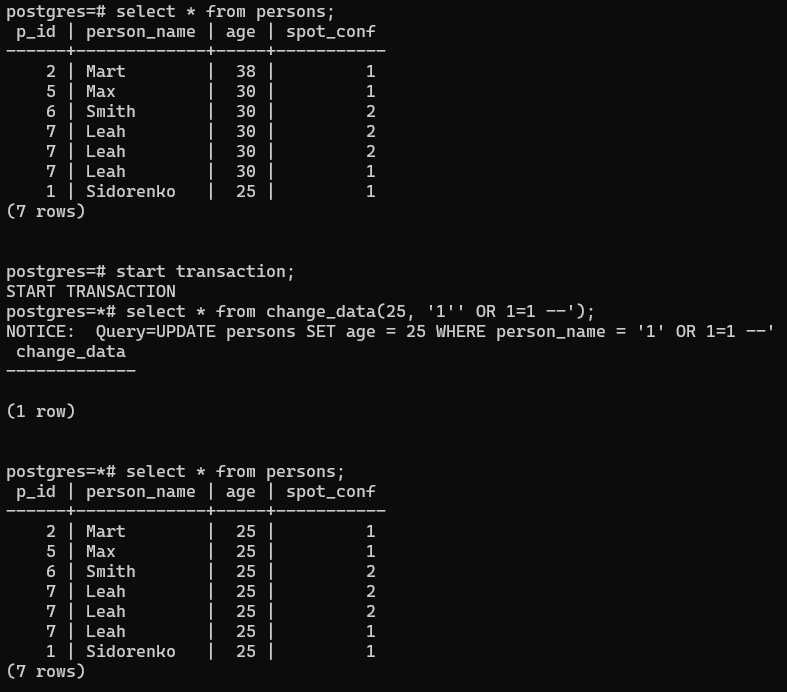

Було створено функцію change_data

Було виконано SQL інєкцію порушення цілістності - порушення цілісності вмісту таблиць БД. завдяки інєкції, усім користувачам було поставлено вік "25", а не лише одному. Для збереження цілістності БД, команда була виконана усередені транзакції, яку потім було відмінено.

