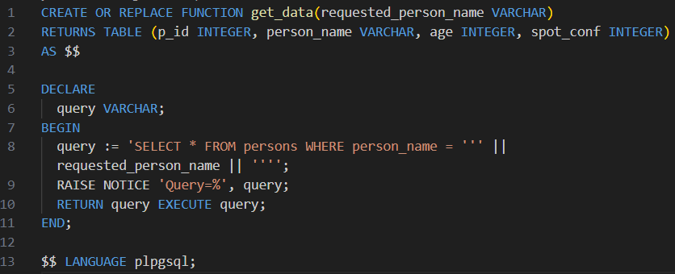
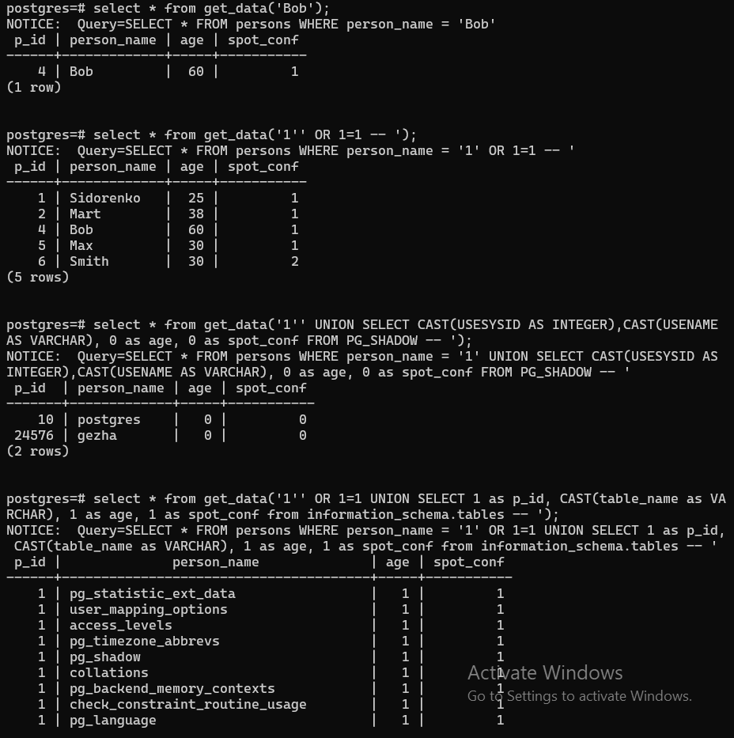

Було створено функцію get_data

Було виконано звичайний select-запит, та три типи SQL інєкцій порушення конфіденційності - зняття фільтрації рядків, отримання вмісту таблиць що не входять до запиту, отримання структури таблиць

