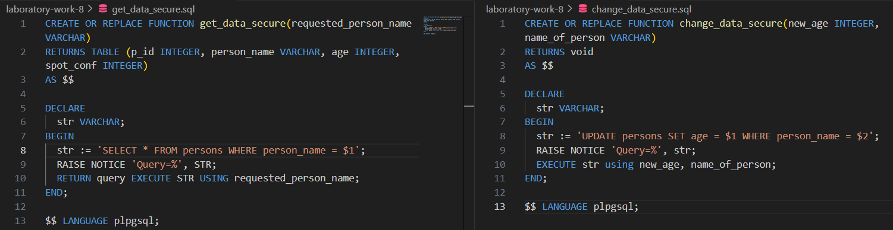
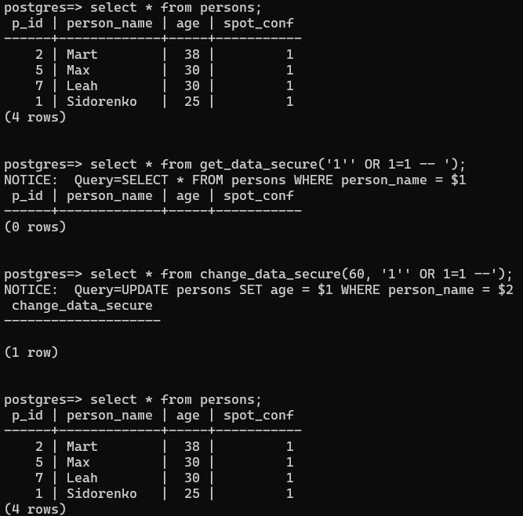

Було створено функції, що вилучають можливість проведення SQL-інєкці

Було виконано спроби провести SQL-інєкцію порушення конфіденційності та цілістності (встановити усім користуваам рік - 60). При спробі порушення конфіденційності запит не повернув ні яких результатів, а спроба порушити цілістність даних не привеа до змін у даних

